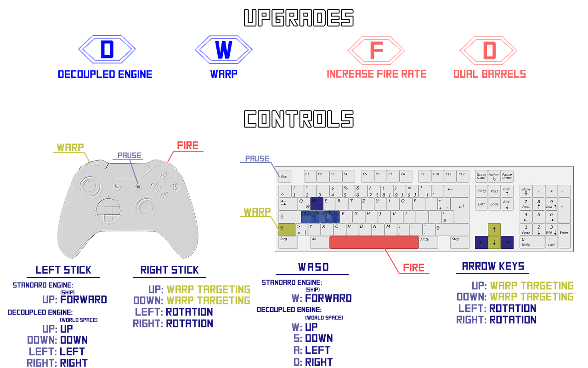

# Mikeroids

> Mikerois is a coding project with the goal to build upon Zigurous' version of Asteroids, adding new features and improving game feel within a limited timeframe.

| Table of Contents                                              |
|----------------------------------------------------------------|
| [1. Plans and Goals](#1-plans-and-goals)                       |
| [2. The First Four Hours](#2-the-first-four-hours)             |
| [3. Another Four to Five Hours](#3-another-four-to-five-hours) |

### Project Details

- **Version**: Unity 2020.3.11f1
- **Controls**: Keyboard / Controller

## 1. Plans and Goals

Asteroids is classic game, and timeless due to it's simple but engaging gameplay. My goal is to add upon it without taking away from that core gameplay and challenge. An upgrade system was my first thought, and while it seems a bit standard/obvious approach, I think it is also the best approach to give the wides range of variety to changes. 

### Upgrades

#### Movement

I had several ideas for changing or adding to movement controls, including a "decoupled" movement, similar to space sim games controls, and a warping mechanic. I quickly decided that I did not want to change the way the ship was aimmed/rotated. I felt this was a unique control to Asteroids that provided a (fun, in my opinion) challenge to get used to, and that changing this might end up having the game feel like just another a dual-stick shooter.

#### Firing

Changing the rate of fire from a controlled pace to full on, hold down the button firing seemed like a fun improvement that I thought players would like trying to find/earn. I also quickly envisioned the idea of having two firing weapons/points/barrels, and that this could alter the rate of fire slightly, as the second one could fire while the first one was in cooldown. A third idea I had was to fire a larger bullet, _like, really larger_, so it would be easier to hit asteroids. Though, I wondered if this would take away too much of the challenge.

#### Detection System

The final upgrade I considered was a detection system that could point to asteroids that were not yet on the screen, as an early warning system. However, I decided this would not be useful or fun, as either there were two many asteroids already on-screen that the player needed to focus on, so they wouldn't be able, or prefer not to, pay attention to the warnings, OR the warnings wouldn't be necessary because the player could easily prepare for the incoming asteroids as there were not enough challenges/asteroids on screen already.

I then also considered changing the idea to instead give a warning if asteroids were getting too close, like a collision detector. However, this happens too often and by quite a lot of asteroids at once after a short period of time, and so again, I deemed it not a necessary/useful/fun feature.

### Dangers & Challenges

I also wanted to add more dangers to the player, beyond the growing number of asteroids. The original version of Asteroids features a flying saucer that shoots at the player. Very quickly, I decided that programming anything with even the simplest of AI would be outside the scope of this project. I consider instead to make the saucer a variation of the asteroid class/objects, which wouldn't use any intelligence in control (thus, flying along via physics trajectory, like the asteroids), but feature a sprite swap and would fire a few bullets in the direction of the player. I felt this was a feasible task, but wouldn't rank high in priorities, as it wasn't exciting my as other ideas. 

To me, adding another "sentient" being the environment changed the feel of the world. Although the saucer does exist in the original game, I felt the game was really about a ship lost in the vastness of space, dealing with the unhurdable dangers of nature. 

_Side note:_ while talking through my ideas with someone, I was asked how "floating upgrades" fit into this scenario then. I feel they are visual representations of the crew repairing or upgrading the ship's systems while in flight/danger. 

However, I still felt another danger or challenge would be necessary, as the game might become unbalanced if the player is able to pick up a few upgrades before being hit. While brainstorming with a colleague, we came up with the idea of collision/trigger that would randomly spawn between two asteroids. I liked where that idea was going, and added it to the list of tasks. 

### HUD and UI Elements

With the additions of upgrades, I felt the HUD should also be upgraded, to allow the player to know the current status of the ship. I envisioned two or three rotating elements, stating the current upgrades.

## 2. The First Four Hours

### Details

- **Version**: v1.0.0
- **Time Spent**: 4 hours (+20 mins to fix a input bug)
- **Repo Link**: [Repo state v1.0.0](https://github.com/MichaelTGood/Mikeroids/tree/releases/v1.0.0)
- **Release**: [Mikeroids v1.0.0](https://github.com/MichaelTGood/Mikeroids/releases/tag/v1.0.0)
- **Packages**:
	- Input System
	- TextMesh Pro
- **Notes**:
  - The game can be quit by pressing `Esc` on the keyboard, or `Start + Select` on a controller.
  - Mouse input is enabled, but does not function well enough to be used. It has been removed in v2.0.
  - There is little to no feed back to the player when upgrades are picked up, and controls change. This can lead to players becoming confused during gameplay, and has been partially fixed in v2.0.

### The Setup

Before beginning, I decided to setup the project in a way that I felt would be indicative of a real world situation/coding standards.  I adjusted the plentiful use of `public` fields to serialize objects in the inspector window to use serialized private fields instead. I also installed Unity's new `Input System`, and setup the inputs to match the controls as they were in the original repository.

### The Process

When I began my four hour stint working, I realized not all the tasks I had setup would be feasible.  First, I wanted to focus on upgrades, as I thought this would provide the biggest change to the project, and would allow me to change and improve the inputs and how they're handled while keeping to the original intent of controls. I also wanted to get a few sounds cues in, and if possible, the HUD, to give more feedback to the player.

My first course of action was to setup the basis for the Upgrade system. I decided use a few `Enums` which would be randomly set when the `Upgrade` was constructed. Not elegant, but quickly got things setup. When the player picks up an upgrade, the `Upgrade` is parsed and either handed off to the `WeaponsSystem` class or sets one of the Engine class.

#### WeaponsSystem

The `WeaponsSystem` provided the most time consuming part as I realized I had not thought through a few things as much as I had thought. Initially, I had wanted in a similar approach as the `Engine` classes, with a simple abstract class with derived classes adding complexity. However, due to the complexity of combinations between the firing upgrades, and that a simple coroutine or two was the quickest way to control the fire rate, I decide to make it a simple `Monobehaviour` that would control all firing situations. 

The `FireRate` was something that went through some testing and changes. Originally, it was going to be _single shot_ versus _full auto_, and would not be combined with the `DualBarrels` upgrade. But while implementing and testing, I felt a middle step,  _burst_, was a fun addition. Also, while trying to determine how to handle switching between firing upgrades, as they were not intended combine, I realized it would actually be more fun if they did. Something about how they fire from both barrels, but at different timing, I found strangely enjoyable, and made me sought after both upgrades more so I could combine them in game. 

Ultimately, I decided the proposed `BigBlaster` upgrade was not as appealing and moved it further down the priority list. I felt it's fun factor would not be as high as the other upgrades. At first, it might be fun, or funny, to see a massive bullet come ot of the ship (I mean, like, _massive_), and it might feel nice to the player as it will seem easier to hit the asteroids. But I think ultimately, it would be more detrimental to the game, as well as taking away from the aesthetic.

While this systems functions perfectly well, if I were to approach this with more time and for a more complete project, I would look into the advantages of refactoring this system to implement child classes for the different upgrades, and if so, also remove the inheritance from `Monobehaviour`, and take a reference to another class specifically setup to run coroutines. My thought is that breaking the system up to child classes could provide easier maintenance as well as extendability.

#### Engine Classes

The `Engine` class thankfully did end up going as I had predetermined in my planning, and was implemented in less time. Due to the change in controls per engine, and the advantages of ease of setup with the new `Input System`, it was easy to setup different engine classes which could turn on and off their respective controls. 

The game starts with the `StandardEngine`, which closely emulates the controls of the original game. The `DecoupledEngine` gives the players more maneuverability, and makes dodging asteroids easier.

The `Warp` upgrade also gives the player the ability to "warp" forward a distance, based on the location of the targeting reticule when they release the button. I really like this feature in theory, but I find while actually playing the game, that it's not as practical as I'd hoped. It's a bit too much to think about at times when you'd really need it, e.g. avoid an asteroid you can't dodge; either because you have to remember how it works and point in the right direction, or because the player will be trying to think quickly to dodge one asteroid, they end up warping into another. Perhaps there's a way to improve it, maybe giving full up/down/left/right control of the reticule, instead of limiting to the Y-axis, but I think ultimately, due to the nature and scope of the Asteroids game, it's probably just not a useful feature regardless.

### The Outcome

While I'm happy with how the upgrades turned out, they unfortunately took up most of my time. Considering the time constraint and list of tasks, I knew this was likely to be the case, and I'm glad I started with them. I think they provide four different, fun new play styles, and combining them takes it even further.  They also gave me a chance to adjust the feel of the ships movement and firing rate. At this point, _I_ find the game quite fun, and notice that testing features tends to go on a little bit longer than necessary, as I'm start actually playing after checking if something works. 

However, I'm also left feeling a lot has been left on the table. Especially in the sense of giving the player feedback to various things, including firing and upgrade status. There are several other features and improvements I'd like to also work on, but the lack of feedback to the player is unfortunate.

> Added Features:
> - Upgrade System
>  - Weapons System
>    - FireRate - Changes the player's firing rate from single shot, to burst shot, to full auto.
>    - DualBarrel - Changes the firing position to two side barrels, which helps spread shots to a wider firing range. Also, halves firing cooldown.
>  - Engine System
>    - Decoupled Engine - Changes the player's controls to up/down/left/right in world space, giving more maneuverability.
>    - Warp Drive - Allows the player to warp forward to determined mark. 

## 3. Another Four to Five Hours

### Details

- **Version**: v2.0.0
- **Time Spent**: 4 - 5 hours
- **Repo Link**: [Repo state v2.0.0](https://github.com/MichaelTGood/Mikeroids/tree/releases/v2.0.0)
- **Release**: [Mikeroids v2.0.0](https://github.com/MichaelTGood/Mikeroids/releases/tag/v1.0.0)
- **Packages**:
    - Input System
    - TextMesh Pro
    - DOTween

After finishing the initial four hours, I was left wishing I had gotten in a few more things, and just overall excited to keep working on the project. I wrote out a list of key elements I felt still needed to touched on or added, and after play testing with a few colleagues, I added and clarified some more. 

Over the next week, I would spend a little more time each day adding some more improvements. My goal was, with the upgrade system in place, to add on the missing features and improvements within the same time constraint. 

> Added Features:
> - Lightening Storm
> - HUD
>   - Firing Rate
>   - Engine Mode
> - Player color animations
>   - Spawn visualization
>   - Level up visualization
> - SFX
>   - Ship firing
>   - Upgrade picked up
>   - Lightning storm created
> - BGM
>   - BGM intensifies when player levels up.
> - Pause Screen
>   - Controls display
>   - Proper Quit option
> - Performance improvements
>   - Cull asteroids and upgrades outside play area.
>   - Refactoring to remove many `Upgrade()` calls.
>   - Refactoring to remove many `FindObjectOfType()` calls.

### Lightening Storm

After having the upgrade system fully playable, my suspicion that a balance would need to be added was correct. Sometimes, its possible to get all the upgrades before you die, and in those cases, it's very to fend off asteroids for awhile. A new challenge needed to be introduced, and for that, I went to the idea I had earlier for a collision/trigger between asteroids. 

After some thought, I came up with the idea that it could be a lightning story spreading between two asteroids. Because it was attached to two moving asteroids, the lightning storm itself would also be moving and spreading, bring the danger to the next level.

A few things I knew that I didn't want were for it to spawn from the beginning, so as to not add too much difficulty, and that it didn't spawn with every asteroid. 

For the latter, I saw that because of how asteroids handle their own destruction and creation of smaller asteroids, this would be an easy place to place the lightning's spawn as well. The way that asteroid splits, upgrades and now lightning are handled/created would be better served in a separate class, instead of within the `Asteroid` class, for sake of moving along quicker and getting features in and tested, I left it as is.

For timing when to start spawning the lightning storms, I came up with the idea that the player would be considered "leveled up" when they reached a certain number of upgrades. At that point, asteroid splits would start spawning lightening storms as well, and they would persist until one of the asteroids was destroyed, either from the player, or reaching the bounds of the play area. By this "level up" time, the player would have better shooting system to destroy the asteroids, or maneuverability to dodge them and the storm. Or, so they would hope!

### Background Music (BGM)

I'd been playing with a few different songs, trying to find the right feel for the game. As mentioned above, I saw the world of the game being far out in the vastness of space, and first was looking for music to reflect this. Music that could be ethereal, chilling and relaxing all at once, if possible. I found a few contenders, but nothing felt right.

After a while, I had to admit there was one song that was often in my head while playing, but it was a very different tone; more face paced. While it didn't match my initial intent, I found while placing it in the game, it did add to intensity/fun of the game. I didn't want to play the song as a whole, as it wasn't really a "soundtrack" song, so I only cut out the driving beat part. 

When I considered that this part itself could be split in two, I knew I'd want to use that, and switch between the two parts when the player "levels up". This, matched with the addition of lightning storms, really took the later gameplay to the next level.

### Feedback / Information for the Player

As stated earlier, the biggest misstep in v1.0 was the lack of feedback and information to the player. I tackled this by added several new elements:

- Pause screen with controls and upgrades explained.
- HUD elements, with current upgrades displayed. 
- The player's ship flickers while it is spawning/ignoring collision from asteroids.
- The player's ship flickers red/blue when it is considered "leveled up", as well as the change in music.
- The ship plays a SFX cue when the player fires.
- The ship plays a SFX cue when it picks up an upgrade.
- The lightning storm plays a SFX cue when it is created.

I don't think this fully solves the problem, but these steps make great advancement on it. I had also considered have a large, semi-transparent text appear in the middle of the screen, scaling up, when a player picks up an upgrade, to help let them know that it happened, and which it was. I wasn't sure if this was a bit too much, or even really necessary, as the player would learn to watch for these upgrades and learn what they were in an acceptable amount of time. More play-testing would be needed to better understand that. 

### The Outcome

I'm much happier with this result. I feel with just a few more hours, I was able to accomplish all of the missing elements that were both necessary, but also just ones I desired. One thing I wish I had thought of earlier was a time based score. I often realized I was never really focused on the score earned from destroy asteroids; for me, the fun was how long could I survive. I think a time based score would a fun way to score next to, or even in place of, the points per asteroid.